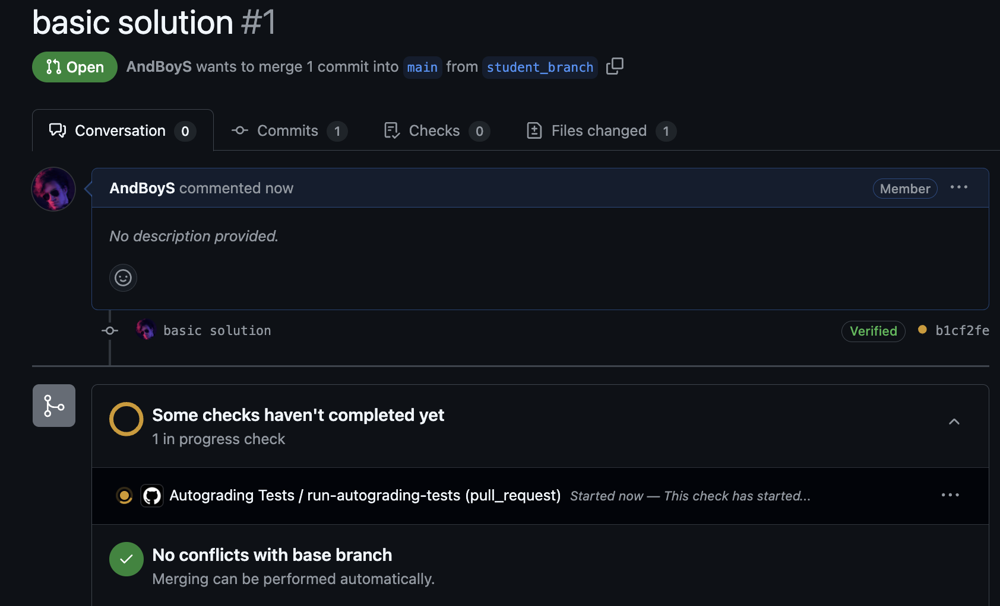
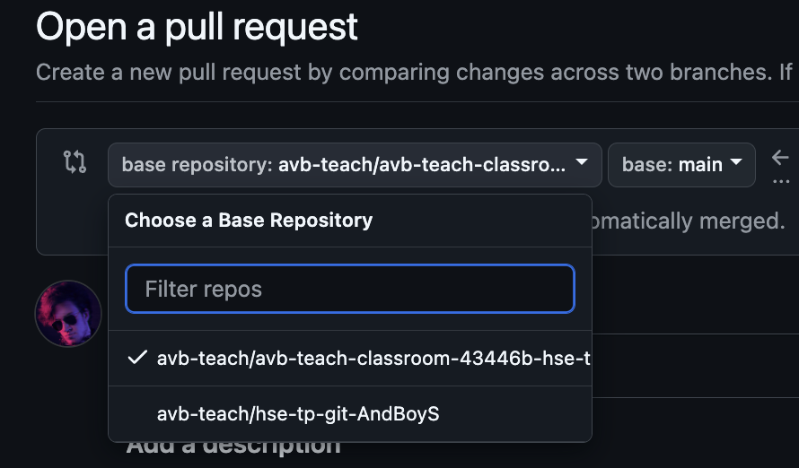

Вам нужно написать скрипт на bash, который на вход принимает два параметра - две директории (`входная директория` и `выходная директория`).

Во `входной директории` могут находиться как файлы, так и вложенные директории (внутри которых тоже могут быть как файлы, так и папки) - уровень вложенности может быть любой.
Задача скрипта - "обойти" `входную директорию` и скопировать все файлы из нее (и из всех сложенных директорий) в `выходную директорию` - но уже без иерархии, а просто все файлы - внутри `выходной директории`.

Скрипт должен вызываться так:

`collect_files.sh /path/to/input_dir /path/to/output_dir`

Скрипт должен быть в корне репозитория

Пример:

`./collect_files.sh /home/input_dir /home/output_dir`

`/home/output_dir` изначально пустая.

Структура `/home/input_dir`:
- input_dir
	- a.txt
	- dir2
		- b.txt
	- dir3
   		- c.txt

Тогда после работы вашего скрипта структура `/home/output_dir` должна быть следующая:
- output_dir
	- a.txt
 	- b.txt
  	- c.txt

### Требования и критерии оценки

- Основной алгоритм вы сможете реализовать на другом языке, и вызвать в скрипте collect_files.sh, но тогда вам нужно будет добавить в скрипт установку этого языка. В среде тестирования предустановлен python версии 3.12.3, можете использовать его. Если хотите использовать другую версию, удобно использовать [uv](https://github.com/astral-sh/uv)
- Все работы будут проверяться на списывание, при обнаружении все баллы за техническое задание обнуляются. Если будете использовать код из интернета, лучше указать ссылку на него как комментарий

За задание вы можете получить максимум **9 баллов**.

- `1 балл` Скрипт запускается и принимает два параметра
- `1 балла` Скрипт работает корректно для вложенности глубины 2 (как в примере). Проблема с файлами, имеющими одинаковое название, не решена
- `2 балла` Скрипт работает корректно для вложенности любой глубины. Проблема с файлами, имеющими одинаковое название, не решена
- `2 балла` Решена проблема с файлами, имеющими одинаковое название. Тогда файлы с одинаковыми названиями получают суффикс, например: name1.txt, name2.txt, ...
- `3 балла` Добавить параметр `--max_depth`, который позволяет оставить глубину (учитывать прошлый пункт необязательно). Например, при `--max_depth 3` будет следующий результат:

- input_dir
	- 1.txt
	- depth2a
		- 2a.txt
		- depth3
			- 3.txt
			- depth4
				- 4.txt
	- depth2b
   		- 2b.txt

- output_dir
	- 1.txt
	- depth2a
		- 2a.txt
		- depth3
			- 3.txt
			- depth4
				- 4.txt
	- depth3
		- depth4
			- 4.txt
	- depth2b
   		- 2b.txt

### Способ отправки

Для отправки решения вам необходимо запушить коммит с вашим решением в свою ветку (ее нужно создать) и сделать пулл реквест. После этого вы сможете посмотреть, сколько баллов вы получили, открыв Autograding Tests

Запуск тестов будет происходить после каждого коммита в эту ветку после открытия пулл реквеста

Мерджить коммиты в main не нужно

Важный момент: делайте пулл реквест в свой репозиторий (по умолчанию выбирается родительский). В примере ниже это будет нижняя опция

